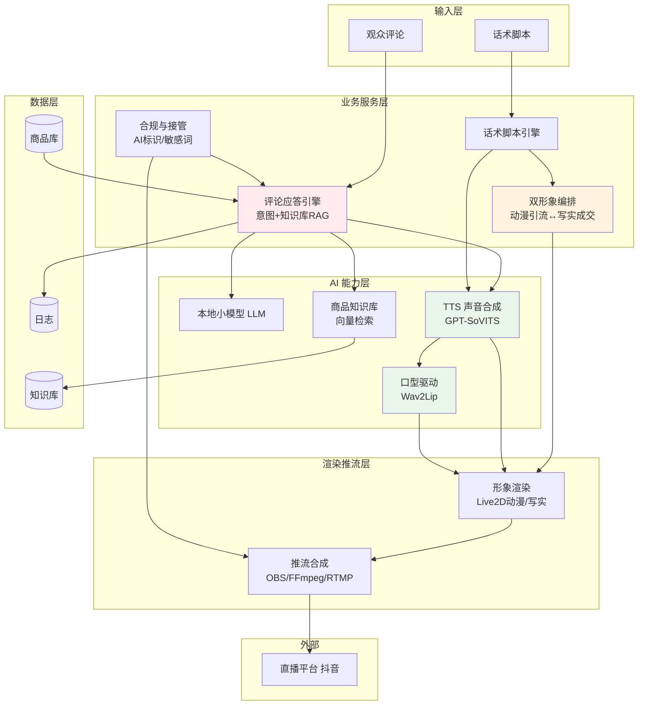
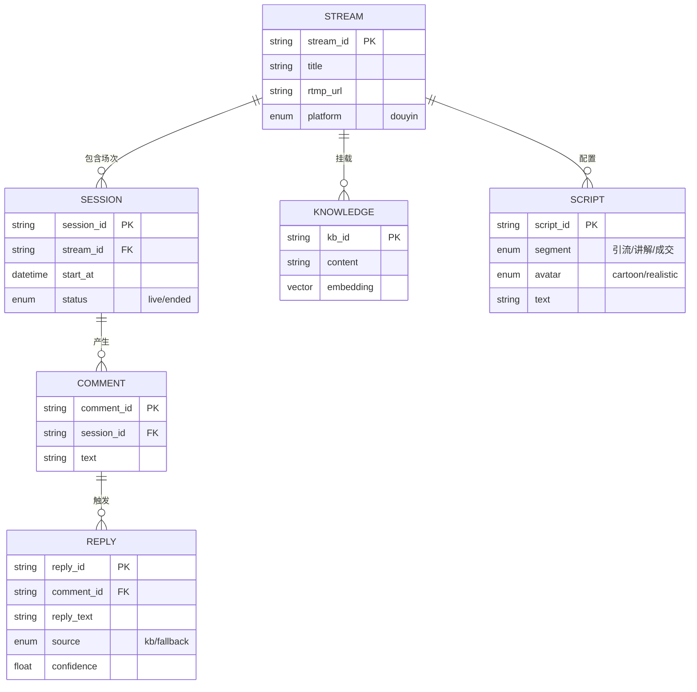
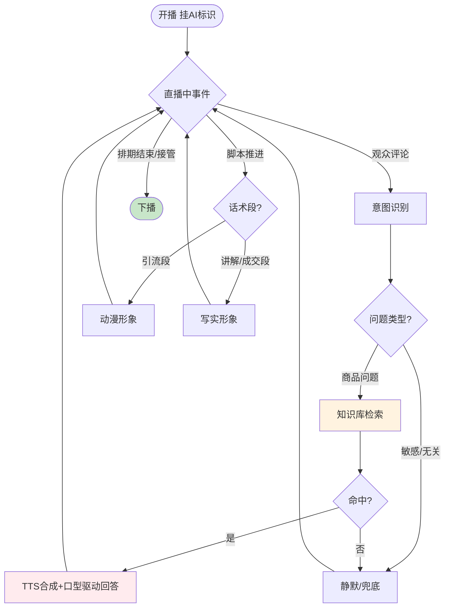
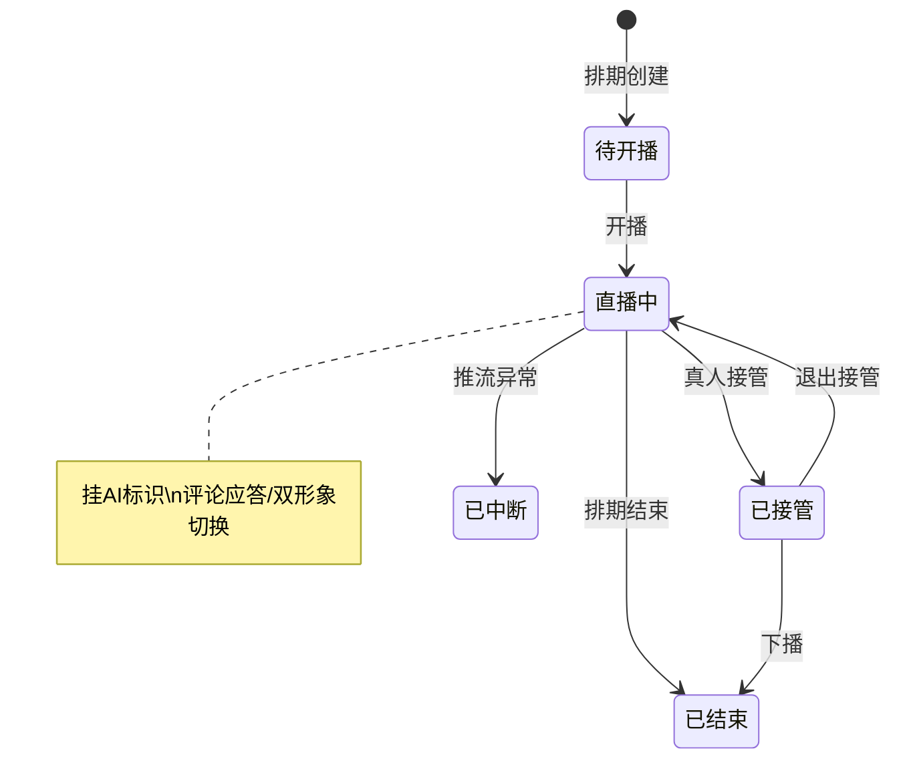

# 《轻量电商数字人》产品需求文档（PRD）

> 一句话：做一个个人能本地跑起来的轻量数字人——动漫形象为主、能直播带货、能实时回评论、合规不封号。本项目是**面试/作品集项目**。

---

| PRD 审核人 | —（个人项目） |
| --- | --- |
| 重要性 | 高 |
| 紧迫性 | 中 |
| 需求方 | 本人（作品项目） |
| PRD 编写人 | 钟于泊 |
| PRD 提交日期 | 2026-08-27 |

## PRD 修改记录

| 变更时间 | 变更内容 | 理由 | 修改人 | 版本号 |
| --- | --- | --- | --- | --- |
| 2026-08-27 | 初始版本，定位为个人轻量数字人作品 | 收敛为个人作品 | 钟于泊 | v0.1 |

---

## 1、项目背景

### 1.1 现状

直播电商是中小商家主渠道，但「人」是瓶颈：主播贵、24h 做不到。数字人方案两极分化——大厂定制贵，开源裸代码不会用。

### 1.2 我要解决的问题

1. 数字人「一问三不知」，交互差导致转化低
2. 数字人「千篇一律」，没记忆点
3. 数字人「贵且重」，个人做不动

### 1.3 解决思路

做一个**轻量数字人**：动漫形象为主（差异化 + 轻量），写实为辅（成交信任），用 LLM + 商品知识库实时应答评论，本地开源技术栈组装，单机可跑。

### 1.4 决策依据

| 因素 | 依据 |
|---|---|
| 需求真实 | 中小商家数字人渗透率低，痛点明确 |
| 差异化成立 | 动漫 + 轻量 + 交互，个人可成立（见 MRD 第4章） |
| 技术可行 | 口型驱动 + 声音克隆 + 本地小模型 LLM 均可开源组装 |
| 个人匹配 | 轻量路线，非重资产，个人可完成 |

---

## 2、需求基本情况

| 要素 | 内容 |
| --- | --- |
| **需求提出人** | 本人 |
| **功能使用人** | 本人（搭建/演示）+ 直播间观众（体验） |
| **核心痛点** | 数字人交互差、同质化、个人做不动 |
| **需求价值** | 证明个人能独立做出一个「有差异化、能落地、能演示」的数字人 |

### 核心场景

**场景：数字人直播带货 + 实时回评论**
- **人物**：动漫形象数字人（为主）+ 写实形象（成交段）
- **时间**：直播中任意时刻
- **地点**：抖音直播间（潮玩垂类）
- **起因**：观众对商品有疑问
- **经过**：观众发评论「这个保质期多久」，数字人实时识别并基于知识库口播回答
- **结果（期望）**：10 秒内准确回答，信任建立，促成下单

---

## 3、竞品与差异化

> 💡 商业化产品的「商业分析」在本项目收敛为「竞品 + 差异化」——作品不卖钱，但要讲清「为什么我做的不一样」。

| 维度 | 大厂定制（硅基/魔珐） | 开源裸方案（HeyGem） | **本项目** |
| --- | --- | --- | --- |
| 拟真度 | 高 | 中 | 中（写实口型驱动） |
| 实时交互 | 弱 | 需自建 | **强（LLM+RAG）** |
| 成本 | 5-10万/年 | 免费但高门槛 | 本地电费级 |
| 上手门槛 | 低（代运营） | 高 | 个人可控 |
| 差异化 | 千人一面 | 无 | **动漫为主 + 轻量 + 交互** |

**差异化定位**：不拼拟真度、不拼技术深度，拼**「动漫形象 + 实时交互 + 轻量落地」的内容打法**——这是大厂做不来（千人一面）、开源不会做（裸技术）的缝。

---

## 4、项目目标

> 💡 作品项目的「收益目标」替换为「验收目标」——衡量标准不是营收，是「能不能跑起来、能不能演示、面试能不能讲」。

### 4.1 项目目标

| 目标类型 | 目标 | 衡量标准 | 时限 |
| --- | --- | --- | --- |
| **核心目标** | 数字人能完整跑通一场带货直播 | 开播→互动→应答→下播闭环 | 项目周期内 |
| **交互目标** | 评论实时应答可用 | 知识库命中准确率 ≥ 90%，10s 内应答 | MVP 前 |
| **拟真目标** | 口型与声音同步，观感不假 | 音画偏差在可接受范围 | MVP 前 |
| **合规目标** | 不因无标识被封 | 默认挂 AI 标识 | 持续 |
| **作品目标** | 面试能讲清「做了什么、为什么差异化、怎么实现」 | 有可演示 Demo + 文档 | 交付时 |

### 4.2 验收标准

| 编号 | 验收项 | 验收条件 |
| --- | --- | --- |
| AC1 | 双形象直播 | 一场直播内动漫引流 ↔ 写实成交可切换 |
| AC2 | 评论应答 | 观众评论商品问题，基于知识库 10s 内正确回答 |
| AC3 | 口型同步 | 写实形象口型与 TTS 音频同步 |
| AC4 | 合规标识 | 直播间默认挂「AI 虚拟人」标识 |
| AC5 | 兜底 | 知识库未命中/敏感问题不胡编，转静默/提示 |
| AC6 | 本地运行 | 单机本地可跑，无需云 GPU |

---

## 5、项目方案概述

> 💡 个人作品核心：不是「技术多强」，而是「开源能力组装成可用的东西」。

### 5.1 功能模块

| 序号 | 功能 | 简述 | 优先级 |
| --- | --- | --- | --- |
| 1 | 双形象 | 动漫/写实形象选择与切换 | P0 |
| 2 | 口型驱动 | 写实口型与音频同步 | P0 |
| 3 | 声音合成 | 声音选择/克隆（GPT-SoVITS） | P0 |
| 4 | 评论应答 | LLM + 知识库实时回评论 | P0 |
| 5 | 话术脚本 | 引流→讲解→成交脚本 | P0 |
| 6 | 商品知识库 | 商品信息导入 + 检索 | P0 |
| 7 | 推流 | 排期开播 + RTMP 推流 | P0 |
| 8 | 合规 | AI 标识 + 真人接管 + 敏感词 | P0 |
| 9 | 数据复盘 | 停留/转化/应答命中率 | P1 |

### 5.2 五层实现手段（轻量、本地、开源）

| 层 | 能力 | 实现手段 | 部署 |
| --- | --- | --- | --- |
| 大脑 | 意图 + 话术 + 问答 | 本地小模型 LLM + RAG 轻量向量库 | 本地 |
| 耳朵 | 评论识别 | 文本评论为主，ASR 可选 | 本地 |
| 嘴巴 | 声音合成 | GPT-SoVITS（小样本克隆） | 本地 |
| 脸 | 口型 / 形象 | 写实 Wav2Lip；动漫 Live2D | 本地 |
| 身体 | 渲染 + 推流 | OBS / FFmpeg + RTMP | 本地 |

> 💡 **关键判断**：模型选型不是重点——本地小模型跑得动就用本地，跑不动就换云端 API 兜底，这是实现细节。真正的核心是**把五层串成低延迟链路 + 做成个人可控的配置**。动漫主力 + 写实辅助，既差异化又轻量，个人机器扛得住。

### 5.3 MVP 范围

**MVP 做**：双形象（1 动漫 + 1 写实）、口型驱动、声音合成、评论应答、知识库、话术脚本、单平台推流、合规标识、真人接管。

**MVP 不做**：自定义 3D 形象、端到端 DiT 高保真、多平台矩阵、语音问答、智能选品。

---

## 6、项目范围

### 6.1 涉及组件

| 组件 | 关系 | 说明 |
| --- | --- | --- |
| 数字人本体 | 主体 | 新建 |
| 形象库（动漫/写实） | 数据资产 | 预制形象 |
| LLM 服务 | 依赖 | 本地小模型 / 云端兜底 |
| 知识库/向量库 | 组件 | 商品信息检索 |
| TTS + 口型引擎 | 组件 | GPT-SoVITS + Wav2Lip |
| 推流 | 组件 | OBS/FFmpeg + RTMP |
| 直播平台 | 外部 | 抖音 |

### 6.2 不在本期范围内

| 排除项 | 理由 |
| --- | --- |
| 自定义 3D 建模 | 高成本，用预制 |
| 端到端 DiT | 非实时、重，个人不做 |
| 多平台矩阵 | 先单平台跑通 |
| 商业化 / 多租户 / 订阅 | 个人作品，不做 |

---

## 7、项目风险

### 7.1 前提假设

| 编号 | 假设 | 不成立的后果 |
| --- | --- | --- |
| A1 | 平台允许带 AI 标识的数字人直播 | 形态失效 |
| A2 | 本地开源链路延迟可接受 | 体验差 |
| A3 | 知识库 RAG 约束下应答准确率够用 | 不胡编是底线 |

### 7.2 风险清单

| 编号 | 风险 | 概率 | 影响 | 应对 |
| --- | --- | --- | --- | --- |
| R1 | 平台限数字人无人直播 | 中 | 高 | AI 标识 + 真人接管，半无人 |
| R2 | LLM 答错商品信息/幻觉 | 中 | 极高 | RAG 强约束 + 事实字段白名单 |
| R3 | 口型/声音链路延迟高 | 中 | 高 | Wav2Lip 轻量 + 预生成缓存 |
| R4 | 个人精力有限，范围失控 | 中 | 中 | 锁单垂类、单平台、单数字人 |

---

## 8、术语和缩略语

| 术语 | 全称 | 说明 |
| --- | --- | --- |
| LLM | Large Language Model | 大语言模型，用于意图理解与应答生成 |
| RAG | Retrieval-Augmented Generation | 检索增强生成，用知识库约束答案防幻觉 |
| TTS | Text-to-Speech | 文本转语音 |
| 口型驱动 | Lip-sync | 让数字人嘴型与音频同步 |
| RTMP | Real-Time Messaging Protocol | 直播推流协议 |
| Live2D | — | 2D 动漫形象动态渲染，轻量 |
| 双形象策略 | — | 动漫引流 + 写实成交 |
| 真人接管 | Human Takeover | 人工介入接管直播的开关 |

## 9、参考文献

| 文档 | 版本 | 说明 |
| --- | --- | --- |
| MRD：轻量电商数字人 | v0.1 | 前置文档 |
| 电商数字人行业调研 | — | 三维调研 |
| Wav2Lip / GPT-SoVITS / MuseTalk / Live2D | — | 开源实现 |
| 抖音数字人/AI 直播规范 | [TODO] | 合规依据 |

---

## 10、功能需求

### 10.1 产品框架概述

#### 10.1.1 应用架构图

#### 10.1.2 数据模型图

#### 10.1.3 核心业务流程图

#### 10.1.4 直播间状态机图

#### 10.1.5 功能清单

| 子系统 | 功能 | 说明 |
| --- | --- | --- |
| 形象 | 动漫/写实选择 | 预制形象 |
| 形象 | 双形象切换 | 按话术段切换 |
| 声音 | 声音合成/克隆 | GPT-SoVITS |
| 口型 | 写实口型同步 | Wav2Lip |
| 应答 | 意图识别 | LLM |
| 应答 | 知识库检索 | RAG |
| 应答 | 兜底 | 不胡编 |
| 话术 | 脚本编排 | 引流→成交 |
| 知识库 | 商品导入 | 批量/手动 |
| 推流 | 排期 + RTMP | 7×24 |
| 合规 | AI 标识/接管/敏感词 | 底线 |

---

### 10.2 产品需求详解

#### 10.2.1 评论实时应答（核心功能）

**业务流程**：评论流入 → LLM 意图识别 → 商品问题走知识库 RAG → 命中则 TTS + 口型口播回答；未命中/敏感走兜底（静默或提示）。

**业务规则：**

| 编号 | 规则类型 | 规则 |
| --- | --- | --- |
| R1 | 约束 | 答案必须来自知识库/商品库，LLM 不编造商品信息 |
| R2 | 约束 | 价格/库存/保质期等事实字段只取商品库 |
| R3 | 触发 | 知识库未命中 → 兜底，不胡编不静默忽略 |
| R4 | 触发 | 敏感/攻击 → 静默 |
| R5 | 约束 | 10s 内应答 |
| R6 | 约束 | 不做未经授权的营销承诺 |

**AI 功能设计：**
- **任务确定性**：中（应答范围广但受知识库约束）
- **容错性**：中（答错可能引发售后，但有兜底）
- **交互模式**：Chat 嵌入直播（对话应答）+ 辅助填充（话术模板）
- **人机边界**：AI 答知识库内问题；事实字段取系统；敏感转真人/静默
- **降级**：未命中 → 静默/「客服稍后回复」；LLM 不可用 → 只走脚本话术
- **模型约束**：低温度，RAG 强约束，禁编营销承诺

#### 10.2.2 双形象编排

**业务流程**：话术脚本每段绑定形象 → 引流段用动漫、讲解/成交段用写实 → 渲染层切换。

| 编号 | 规则类型 | 规则 |
| --- | --- | --- |
| R7 | 约束 | 每段脚本必须绑定形象 |
| R8 | 事实 | 默认动漫引流、写实成交，可自定义 |
| R9 | 约束 | 切换平滑不黑屏 |

#### 10.2.3 合规与接管

| 编号 | 规则类型 | 规则 |
| --- | --- | --- |
| R10 | 约束 | AI 标识强制开启，不可关 |
| R11 | 触发 | 一键接管后数字人立即静音 |
| R12 | 事实 | 应答日志可追溯 |

---

### 10.3 异常情况处理

| 异常 | 场景 | 处理 |
| --- | --- | --- |
| 网络异常 | 推流中断 | 自动重连 |
| 并发 | 评论刷屏 | 频率限制 + 去重 |
| 数据异常 | 商品库空价格 | 拦截，不播报异常值 |
| AI 异常 | LLM 不可用 | 降级为脚本话术 |
| AI 异常 | 幻觉 | RAG 强约束 + 事实白名单 |
| 安全 | 恶意提问 | 敏感词过滤 + 静默 |
| 合规 | 检测无标识 | 强制标识，检测关闭即下播 |

---

## 11、数据与验收指标

> 💡 作品项目的数据指标服务于「验证跑通 + 面试可讲」，不是运营 KPI。

| 指标 | 计算 | 用途 |
| --- | --- | --- |
| 知识库命中率 | 命中/商品咨询 | 应答质量 |
| 应答准确率 | 评测集 | 不胡编 |
| 事实忠实度 | 输出 vs 商品库 | ≥ 99% |
| 应答延迟 P95 | replied_at - created_at | ≤ 10s |
| 停留/转化 | 平台数据 | 证明「动漫+交互」有效 |
| 兜底率 | 兜底/总评论 | < 10% |

---

## 12、里程碑计划

| 阶段 | 内容 | 产出 |
| --- | --- | --- |
| M1 技术验证 | PoC：Wav2Lip + GPT-SoVITS + LLM 串链路 | 能跑的最小 demo |
| M2 功能搭建 | 双形象 + 应答 + 知识库 + 推流 | 完整数字人 |
| M3 垂类落地 | 潮玩垂类，配话术/知识库 | 可演示的带货直播 |
| M4 打磨 | 合规 + 复盘 + 文档 | 面试可讲的完整作品 |

---

## 13、待决事项

| 编号 | 待决事项 | 优先级 |
| --- | --- | --- |
| TBD-1 | ~~锁哪个垂类~~ 已锁定：潮玩（手办/盲盒/谷子） | 已定 |
| TBD-2 | 口型 Wav2Lip 还是 MuseTalk（实测延迟） | 高 |
| TBD-3 | LLM 本地小模型够不够答好商品咨询（PoC） | 高 |
| TBD-4 | 动漫形象来源（自建 Live2D / 用现成） | 中 |
| TBD-5 | 平台合规备案流程 | 中 |

> ⚠️ 优先解决 TBD-1（垂类）和 TBD-2/TBD-3（技术 PoC），这两个决定项目能不能落地。

---

> 💡 建议：优先验证 TBD-2/TBD-3 的技术 PoC，确认本地轻量链路可行后再展开搭建。
